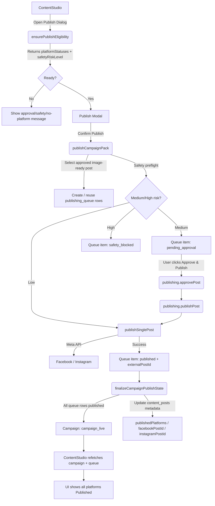

# NatForgeAI Campaign Publishing Workflow – System Documentation and Production Verification

> **Milestone:** Campaign Publishing Workflow Hardening  
> **Branch:** `feature/ux-workflow-hardening`  
> **Production Campaign:** Campaign #23 – 3@1 Newmarket Campaign  
> **Last Updated:** 2026-07-06

---

## 1. Executive Summary

This document describes the completed end-to-end publishing workflow for NatForgeAI campaign packs. The workflow now supports publishing AI-generated campaign content to connected Meta platforms (Facebook Pages and Instagram professional accounts), handling partial publishes, safety approvals, and workflow finalization.

### What was fixed

- **Facebook and Instagram publishing now works end-to-end.** Connected integrations are detected correctly, the right content post is selected, and posts are sent to each platform.
- **Instagram can publish directly.** When content is low-risk and the Instagram integration is publishing-ready, the post goes live immediately.
- **Facebook medium-risk content can be held for approval and later approved/published without duplicating Instagram.** If Facebook content is flagged as medium risk, the queue item enters `pending_approval`. A user can then click **Approve & Publish** for Facebook only; Instagram is reused/skipped because it is already published.
- **Campaign finalizes to `campaign_live` once all platforms are published.** A new `finalizeCampaignPublishState` helper checks every `publishing_queue` row for the campaign and updates the campaign and content post metadata when every row reaches `published`.
- **Refinement failure no longer corrupts the approved leaflet.** If a premium leaflet refinement fails, the previous approved image-ready asset is preserved and the error is stored in `metadata.lastRefinementError`.
- **Social profile duplicate issue was fixed with migration 0014.** The `social_profiles` table now has a unique constraint on `(userId, platform, externalId)` and audience ingestion upserts by that tuple.

---

## 2. Business Outcome

### User and business value

- **Campaign packs can be published to connected Meta platforms.** Users no longer need to copy content manually when integrations are connected.
- **Partial publishing is safe.** One platform can publish while another waits for approval or fails; the system does not leave the campaign in an inconsistent state.
- **Users can see platform-level status.** The Content Studio UI shows each platform’s publishing status: Published, Pending approval, Failed, or Publishing in progress.
- **Approval-required content is handled visibly.** Medium-risk platforms are flagged before publish and shown with an explicit approval action.
- **Already-published platforms are not republished on retry.** Queue idempotency prevents duplicate posts, which protects brand reputation and avoids duplicate charges/credits.
- **Campaign status reflects real publishing completion.** The campaign only moves to `campaign_live` when every required platform queue item is `published`.

---

## 3. Production Environment

| Item | Value |
|------|-------|
| **Local repository path** | `D:\react\natdev\Natforgeai` |
| **PM2 process name** | `NatForgeAI-Backend` |
| **Backend bind address** | `http://127.0.0.1:3001` |
| **Reverse proxy** | IIS with ARR (Application Request Routing) |
| **Git branch** | `feature/ux-workflow-hardening` |
| **Database** | MySQL (via `DATABASE_URL` env variable) |
| **Cache / job broker** | Redis (verified connected at startup) |
| **Persistent generated media** | `data/public/generated` |
| **Persistent uploads** | `data/public/uploads` |
| **Build output** | `dist/boot.js`, `dist/worker.js`, `dist/public/` |

> **Note:** Production is a Windows server. Do not use `/var/www/aimarketing` or the `ai-marketing` PM2 process name on this environment.

---

## 4. Key Production Verification Result

### Campaign #23 final verified state

#### `publishing_queue`

| Platform | queueItemId | status | externalPostId | approvalRequired | safetyStatus |
|----------|-------------|--------|----------------|------------------|--------------|
| Facebook | 5 | `published` | `122144189559083955` | 1 | `medium` |
| Instagram | 6 | `published` | `18106085213021936` | 0 | `low` |

#### `campaigns`

| Field | Value |
|-------|-------|
| `campaignId` | 23 |
| `status` | `active` |
| `workflowState` | `campaign_live` |

#### `content_posts`

| Field | Value |
|-------|-------|
| `contentPostId` | 109 |
| `type` | `social_post` |
| `status` | `published` |
| `metadata.publishedPlatforms` | `["facebook", "instagram"]` |
| `metadata.failedPlatforms` | `[]` |
| `metadata.pendingApprovalPlatforms` | `[]` |
| `metadata.facebookPostId` | `122144189559083955` |
| `metadata.instagramPostId` | `18106085213021936` |
| `metadata.imageStatus` | `ready` |
| `metadata.imageUrl` | present and unchanged |

---

## 5. Timeline of Issues and Fixes

### A. Frontend publish guard showed “Connected platform data missing”

- **Root cause:** `ensurePublishEligibility` returned `unavailableReason="ready"` but `platformStatuses` was empty, so the UI contract guard blocked the action.
- **Fix:** `ensurePublishEligibility` now derives `platformStatuses` from actually connected integrations and only returns `ready` when at least one connected platform status exists.
- **Commit:** `c633ce7`

### B. `publishCampaignPack` saw integrations but `publishablePlatforms` was empty

- **Root cause:** The publish flow used a different platform mapping path than eligibility, causing supported connected platforms to be dropped silently.
- **Fix:** `publishCampaignPack` now uses a shared `AUTO_PUBLISH_PLATFORMS` set and derives `publishablePlatforms` directly from connected integrations. A contract error is thrown if supported connected platforms are missing.
- **Commit:** `00a3b77`

### C. “No approved social post found”

- **Root cause:** The publish flow expected an `approvalStatus` column or `status="approved"`, but production schema stores approval in `metadata.approved` and `content_posts.status` only supports `draft/scheduled/published/archived`.
- **Fix:** Post selection uses `metadata.approved`, `metadata.imageStatus="ready"`, `metadata.imageUrl`, and supports `master_campaign_post` reuse across platforms.
- **Commit:** `ca460e1`

### D. Failed leaflet refinement corrupted the approved publishable asset

- **Root cause:** A failed refinement overwrote `imageStatus` to `failed`, making the previously approved asset unpublishable.
- **Fix:** A pre-refinement snapshot preserves `approved`, `imageStatus`, `imageUrl`, `assetKind`, `currentVersionId`, `iterationNumber`, and `imageProvider` on failure. The error is stored in `metadata.lastRefinementError`.
- **Commit:** `b024f88`

### E. Facebook blocked by medium-risk safety approval after Instagram published

- **Root cause:** The medium-risk approval gate was enforced inside `publishSinglePost` but was not surfaced in eligibility or the UI, and the pack-publish path did not provide a clean per-platform retry.
- **Fix:** `ensurePublishEligibility` runs a safety preflight and returns `safetyRiskLevel` / `platformSafety`. The UI shows pending approval status and an **Approve & Publish** action. Facebook can be approved and published independently.
- **Commit:** `eecf6df`

### F. Risk of duplicate Instagram publishing on retry

- **Root cause:** Retry could recreate or reprocess queue items without checking for existing rows.
- **Fix:** Queue idempotency by `(userId, campaignId, contentPostId, platform)`. Existing `published` or `pending_approval` rows are reused/skipped.
- **Commit:** `eecf6df`

### G. Campaign stayed `launch_approval_required` after both platforms published

- **Root cause:** The per-platform **Approve & Publish** flow updated the queue item but did not finalize the campaign workflow state or content post metadata.
- **Fix:** New `finalizeCampaignPublishState` helper checks all `publishing_queue` rows for the campaign. When every row is `published`, it moves the campaign to `campaign_live`, updates content post metadata, and clears pending `campaign_launch` approvals.
- **Commit:** `7ba5b75`

### H. Duplicate `social_profiles` rows

- **Root cause:** `social_profiles` had only a non-unique index on `(userId, platform, externalId)`, so `INSERT ... ON DUPLICATE KEY UPDATE` could not dedupe and created duplicate rows.
- **Fix:** Migration `0014_dedupe_social_profiles.sql` removes duplicates and adds a unique constraint. Audience ingestion now explicitly upserts by `(userId, platform, externalId)`.
- **Commit:** `eecf6df`

---

## 6. Architecture Overview

### Components

| Component | Responsibility |
|-----------|----------------|
| **ContentStudio UI** | Displays campaign pack, platform statuses, publish dialog, and per-platform approval actions. |
| **ensurePublishEligibility** | Checks connected integrations, launch approvals, publishable content, and runs a safety preflight. |
| **publishCampaignPack** | Creates or reuses queue items for each connected platform, runs safety preflight, calls `publishSinglePost` for low-risk items, and finalizes state. |
| **publishing_queue** | Persistent per-platform publish job queue and source of truth for platform status. |
| **publishing-runner** | Contains `publishSinglePost`, `runSafetyCheckOnQueueItem`, and `finalizeCampaignPublishState`. |
| **publishing.approvePost** | Sets a `pending_approval` queue item to `approved`. |
| **publishing.publishPost** | Calls `publishSinglePost` for an approved queue item. |
| **finalizeCampaignPublishState** | Decides whether the campaign is fully published and updates campaign/content post state. |
| **Meta/Facebook/Instagram adapters** | Make actual API calls using page access tokens and Instagram business account IDs. |
| **content_posts metadata** | Stores approval, image status, platform post IDs, and platform status arrays. |
| **campaigns workflowState** | Tracks high-level campaign lifecycle (`strategy_approved`, `creatives_ready`, `launch_approval_required`, `campaign_live`). |

### End-to-end flow



---

## 7. Data Model

### `campaigns`

| Field | Meaning |
|-------|---------|
| `id` | Campaign identifier. |
| `status` | `draft` / `active`. |
| `workflowState` | Lifecycle state: `strategy_approved`, `creatives_ready`, `launch_approval_required`, `campaign_live`, etc. |

### `content_posts`

| Field | Meaning |
|-------|---------|
| `id` | Content post identifier. |
| `campaignId` | Parent campaign. |
| `type` | `social_post`, `video_concept`, etc. |
| `platform` | Target platform if platform-specific. |
| `status` | `draft` / `scheduled` / `published` / `archived`. |
| `publishedAt` | Timestamp when fully published. |
| `metadata.approved` | Boolean set when the user or workflow approves the post. |
| `metadata.assetKind` | e.g. `social_post`, `master_campaign_post`. |
| `metadata.imageStatus` | `concept` / `rendering` / `ready` / `failed`. |
| `metadata.imageUrl` | URL to the publishable image asset. |
| `metadata.publishedPlatforms` | Array of platforms successfully published. |
| `metadata.failedPlatforms` | Array of platforms that failed or were safety-blocked. |
| `metadata.pendingApprovalPlatforms` | Array of platforms awaiting approval. |
| `metadata.facebookPostId` | Facebook external post ID. |
| `metadata.instagramPostId` | Instagram external post ID. |
| `metadata.lastRefinementError` | Error message from a failed refinement; preserved asset remains usable. |

### `publishing_queue`

| Field | Meaning |
|-------|---------|
| `id` | Queue item identifier. |
| `userId` | Owner user. |
| `campaignId` | Parent campaign. |
| `contentPostId` | Linked content post. |
| `platform` | `facebook`, `instagram`, etc. |
| `status` | `draft` / `approved` / `pending_approval` / `published` / `failed` / `safety_blocked` / `retrying`. |
| `approvalRequired` | Boolean; true when human approval is needed. |
| `safetyStatus` | `low` / `medium` / `high`. |
| `safetyReasons` | JSON array of reasons from the safety checker. |
| `externalPostId` | Platform-provided post ID after successful publish. |
| `publishedAt` | Timestamp of successful publish. |
| `lastError` | Last error message for failed/pending items. |
| `integrationId` | Linked `social_integrations` row. |

### `social_integrations`

| Field | Meaning |
|-------|---------|
| `platform` | `facebook` / `instagram`. |
| `status` | `connected` / `disconnected`. |
| `pageId` | Facebook Page ID. |
| `instagramBusinessAccountId` | Linked Instagram business account ID. |
| `pageAccessTokenEncrypted` | Encrypted token used for publishing. |

### `social_profiles`

| Field | Meaning |
|-------|---------|
| `userId` | Owner user. |
| `platform` | `facebook_page`, `instagram_account`, etc. |
| `externalId` | Platform-provided profile/page ID. |
| **Unique index** | `user_platform_external_idx` on `(userId, platform, externalId)`. |

---

## 8. Publishing Status Model

| Status | When it applies |
|--------|-----------------|
| **ready** | Eligibility check passed; campaign can be published to connected platforms. |
| **pending_approval** | Queue item held because content was flagged medium risk or an approval workflow requires it. |
| **published** | Queue item successfully posted to the platform and has an `externalPostId`. |
| **failed** | Queue item exhausted retries or hit a non-safety error (e.g. missing token, API error). |
| **safety_blocked** | Queue item blocked due to high safety risk. |
| **launch_approval_required** | Campaign workflow state when not all platforms are published or launch approval is pending. |
| **campaign_live** | Campaign workflow state when every `publishing_queue` row for the campaign is `published`. |

---

## 9. Safety Approval Model

1. **Safety preflight** runs before any queue item is created or published. It calls `checkContentSafety` with `skipDeduction: true` so it does not consume credits or cause credit-related failures during preflight.
2. **Low risk:** The queue item is created with status `approved` and `publishSinglePost` attempts immediate publishing.
3. **Medium risk:** The queue item is created with status `pending_approval` and `approvalRequired = true`. The UI shows **Approve & Publish**. After approval, `publishSinglePost` trusts the explicit approval and publishes.
4. **High risk:** The queue item is blocked (`safety_blocked`) and cannot be published until the content is revised.
5. **UI behavior:** The publish dialog surfaces medium/high risk before the user clicks Confirm Publish, and the campaign pack card shows per-platform status with the safety reason.

---

## 10. Idempotency Rules

- **Queue item lookup** uses `(userId, campaignId, contentPostId, platform)`.
- If an existing queue item is `published`, it is reused and counted as already published; no API call is made.
- If an existing queue item is `pending_approval`, it is reused and the UI shows the existing pending state.
- `publishCampaignPack` does not create duplicate queue rows for the same platform.
- **Retry should only process failed or approved pending items.** A whole-campaign retry must not republish already-live platforms.
- The main **Publish Campaign Pack** button remains safe to click because of the reuse logic, but users should prefer the per-platform **Approve & Publish** / **Retry** actions for clarity.

---

## 11. Refinement Rollback Rules

When `generatePremiumLeaflet` receives a refinement instruction and the refined result fails validation:

1. The previous approved publishable asset metadata must **not** be mutated.
2. The following fields are preserved:
   - `approved`
   - `imageStatus`
   - `imageUrl`
   - `assetKind`
   - `currentVersionId`
   - `iterationNumber`
   - `imageProvider`
3. The failure reason is stored in `metadata.lastRefinementError`.
4. On a successful refinement, `lastRefinementError` is cleared.
5. The UI shows an amber banner: **“Refinement failed; your previous approved leaflet was preserved.”**

---

## 12. Migration Documentation

### File

```
db/migrations/0014_dedupe_social_profiles.sql
```

### Purpose

- Removes duplicate rows from `social_profiles` for the same `(userId, platform, externalId)` tuple, keeping the earliest `id`.
- Replaces the non-unique index `user_platform_external_idx` with a unique constraint on `(userId, platform, externalId)`.

### Idempotency

**This migration is not idempotent.** The `ALTER TABLE ... ADD CONSTRAINT UNIQUE` statement will fail if run a second time because the constraint already exists. Run it exactly once per environment.

### Verification SQL

```sql
-- Verify the index is unique
SHOW INDEX FROM social_profiles;

-- Verify no duplicates remain
SELECT userId, platform, externalId, COUNT(*)
FROM social_profiles
GROUP BY userId, platform, externalId
HAVING COUNT(*) > 1;
```

### Production recovery result

- Duplicates after migration: **none**
- `user_platform_external_idx` is now a **unique** index.

---

## 13. Commits Included

| Commit | Description |
|--------|-------------|
| `c633ce7` | Guarantee `platformStatuses` in `ensurePublishEligibility` response and log it. |
| `f0b0a8c` | Derive `platformStatuses` from connected integrations and harden ready invariant. |
| `00a3b77` | Derive `publishablePlatforms` from connected integrations and add contract invariant. |
| `ca460e1` | Select approved image-ready social posts without `approvalStatus` and support `master_campaign_post` reuse. |
| `b024f88` | Rollback approved image-ready asset on refinement failure and surface `lastRefinementError`. |
| `eecf6df` | Safety preflight, partial publish idempotency, approval flow, `social_profiles` dedupe. |
| `7ba5b75` | `finalizeCampaignPublishState` and workflow finalization after last platform publishes. |

---

## 14. Production Deployment Commands

Run these commands **only** on the Windows production server from `D:\react\natdev\Natforgeai`:

```powershell
cd D:\react\natdev\Natforgeai
git pull origin feature/ux-workflow-hardening
git log -1 --oneline
npm install --include=dev
npm run check
npm test -- --run
npm run build
pm2 flush NatForgeAI-Backend
pm2 restart NatForgeAI-Backend --update-env
pm2 status
```

### Important notes

- Do **not** use `/var/www/aimarketing` commands on this Windows production setup.
- Do **not** use the PM2 process name `ai-marketing` on this server; the correct process is `NatForgeAI-Backend`.
- If a database migration is included in the deployed commit, apply it before restarting the backend.

---

## 15. Verification Commands

### Check publishing queue and campaign state

```sql
SELECT id, platform, status, externalPostId, approvalRequired, safetyStatus, lastError
FROM publishing_queue
WHERE campaignId = 23
ORDER BY id;

SELECT id, status, workflowState
FROM campaigns
WHERE id = 23;

SELECT id, status, metadata
FROM content_posts
WHERE campaignId = 23 AND type = 'social_post';
```

### Check PM2 logs

```powershell
Get-Content "C:\Users\Administrator\.pm2\logs\NatForgeAI-Backend-out.log" -Tail 500
Get-Content "C:\Users\Administrator\.pm2\logs\NatForgeAI-Backend-error.log" -Tail 150
```

### Quick health check

```powershell
pm2 status
pm2 show NatForgeAI-Backend
```

---

## 16. QA Test Scenarios

- [ ] Connected Facebook and Instagram integrations show as **Connected** in the publish modal.
- [ ] Publish modal lists connected platforms before confirming.
- [ ] Low-risk Instagram publishes immediately and queue item shows `published` with `externalPostId`.
- [ ] Medium-risk Facebook goes to `pending_approval` with `approvalRequired = 1`.
- [ ] **Approve & Publish** on the Facebook queue item publishes only Facebook; Instagram is not duplicated.
- [ ] After both platforms publish, the campaign `workflowState` changes to `campaign_live`.
- [ ] Content Studio no longer shows **Launch approval required** or **Publishing pending**.
- [ ] `content_posts.metadata` contains `publishedPlatforms: ["facebook", "instagram"]`, `facebookPostId`, and `instagramPostId`.
- [ ] Failed premium refinement preserves the previous approved leaflet and shows the amber preservation banner.
- [ ] Audience sync does not create duplicate `social_profiles` rows for the same external page/account.
- [ ] Refreshing Content Studio reflects the latest queue/platform status without requiring a hard reload.

---

## 17. Support Playbook

### Publish button says “Connected platform data missing”

- Verify `social_integrations` rows exist with `status = 'connected'` for the user/business.
- Call `ensurePublishEligibility` and check the response has `platformStatuses` with at least one connected platform.
- Check backend logs for the eligibility response.

### Platform is pending approval

- This is expected for medium-risk content.
- Instruct the user to click **Approve & Publish** next to the pending platform.
- Do not click **Publish Campaign Pack** again unless specifically needed.

### One platform published and one failed

- Check `publishing_queue.lastError` for the failed platform.
- Fix the underlying issue (e.g. reconnect Meta, grant permissions, add credits).
- Use the per-platform **Retry** button.

### User accidentally clicks publish again

- Reassure: idempotency prevents duplicate published posts.
- The action will reuse existing queue rows and skip already-published platforms.

### Refinement fails

- Confirm `metadata.lastRefinementError` is populated.
- Confirm `metadata.imageStatus` remains `ready` and `metadata.imageUrl` is unchanged.
- If the user wants a different refinement, submit a new instruction.

### Campaign says launch approval required even though all queue rows are published

- This should not happen after commit `7ba5b75`.
- If it occurs on legacy data, manually run:
  ```sql
  UPDATE campaigns SET workflowState = 'campaign_live', status = 'active' WHERE id = <campaignId>;
  ```
- Check that `finalizeCampaignPublishState` is being called from `publishSinglePost`.

### Instagram/Facebook external post IDs are missing

- Check `publishing_queue.externalPostId` for the platform.
- If null but status is `published`, the platform API may not have returned an ID; review logs.

### Redis disconnects

- Verify Redis service is running.
- Check `DATABASE_URL` and Redis connection env variables.
- Restart `NatForgeAI-Backend` after Redis is restored.

### Migration fails due to `statement-breakpoint` marker

- Some MySQL clients choke on Drizzle’s `--> statement-breakpoint` comments.
- Run the migration through the app’s migration runner or strip the comments before running manually.

---

## 18. Known Non-Issues / Clarifications

- **`content_posts.status` does not have `approved`.** Approval is stored in `metadata.approved`. The `status` column only tracks `draft/scheduled/published/archived`.
- **`master_campaign_post` can be reused for both Facebook and Instagram.** The platform-specific match is tried first; if no match, the master post is used.
- **A medium-risk Facebook item with `approvalRequired = 1` is still valid.** After human approval it can be published normally.
- **`publishing_queue` is the source of truth for per-platform status.** The UI and finalization logic read from queue rows, not only from `content_posts.status`.
- **Content post #109 being platform “Instagram” does not prevent Facebook publishing.** The `master_campaign_post` fallback selects the same post for Facebook.

---

## 19. Risks and Future Improvements

| Recommendation | Rationale |
|----------------|-----------|
| Add an admin UI for viewing `publishing_queue` | Faster support triage without SQL access. |
| Add a manual recovery button for stuck partial publishes | Allows admins to re-run finalization safely. |
| Add stronger Meta response logging | Easier debugging of failed platform publishes. |
| Add a smoke test with `NATFORGE_SMOKE_URL` | Verify deployment health automatically after release. |
| Improve chunk splitting for the ContentStudio bundle | Reduce the ~482 kB ContentStudio chunk and initial load time. |
| Improve user-facing wording around medium-risk approval | Reduce confusion about why approval is required. |
| Add monitoring/alerting for publish failures | Proactive support instead of user-reported issues. |
| Add a DB migration runner that strips Drizzle `statement-breakpoint` markers | Avoid manual migration issues on strict MySQL clients. |

---

## 20. Final Milestone Status

- ✅ Campaign Publishing Workflow milestone is complete.
- ✅ Campaign #23 is live on **Facebook** and **Instagram**.
- ✅ Production state verified: both queue rows `published`, campaign `campaign_live`, content post metadata populated.
- ✅ No further publishing action is required for Campaign #23.

